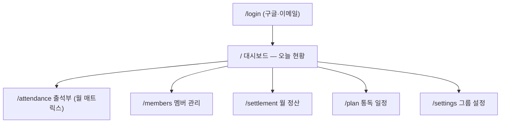

# 묵상대학 운영자 대시보드 기획서 (v0.1)

> 작성일: 2026-07-02 · 상태: 기획 초안 (구현 전)
> 상위 문서: [SPEC_SAAS.md](./SPEC_SAAS.md) — 이 문서는 그중 "콘솔 앱"의 첫 제품인 **운영자 대시보드**를 구체화한다.
> 확정 전제: 홈페이지(home.qtuniv.com)는 정적 유지 · 콘솔은 **별도 앱** · Supabase `muksang-univ`(서울) 사용 · 구글+이메일 인증 · 무료

---

## 1. 배경 & 문제 정의

현재 묵상대학 운영은 **카톡방 확인 + 수기 기록 + 수동 정산**으로 돌아간다.

| 운영 업무 | 현재 방식 | 페인 포인트 |
|---|---|---|
| 매일 출석 확인 | 카톡방에서 제출 글을 눈으로 확인 | 매일 반복, 놓치기 쉬움 |
| 출석부 기록 | 수기(스프레드시트/노션) | 이중 작업, 오기입 |
| 월말 정산 | 결석·지각 세어서 환급/차감 수동 계산 | 규칙이 복잡(10%/5%/환산/한도)해 실수 위험, 시간 소모 |
| 멤버 관리 | 카톡 초대 + 구두 안내 | 명단·상태 산재 |

**운영자 대시보드의 목표**: 위 4가지를 한 화면 체계로 옮겨 — ① 매일 출석 체크를 5분 이내로, ② 월 정산을 클릭 한 번의 자동 계산으로, ③ 모든 기록을 감사 가능한 데이터로 남긴다.

### 비목표 (이번 범위 아님)
- 멤버 셀프 제출 화면(멤버용 콘솔) — Phase C로 후순위
- 결제/송금 연동 (정산은 **계산·리포트까지만**, 실제 입출금은 오프라인)
- 다중 그룹 UI (스키마는 그룹 기준 유지, UI는 단일 그룹 가정)

---

## 2. 페르소나 & 핵심 시나리오 (JTBD)

**운영자** = 다윗소년, 남매공작소 (그룹 `owner`/`admin` 역할)

| # | 시나리오 | 완료 기준 |
|---|---|---|
| J1 | 아침에 접속해 **어제 누가 미제출인지** 확인하고 리마인드한다 | 미제출자 명단 복사 → 카톡 붙여넣기 30초 |
| J2 | 카톡방 글을 보며 **오늘 출석부를 체크**한다 | 멤버당 탭 1번, 전체 5분 이내 |
| J3 | 월말에 **환급·차감·장학 정산표**를 만든다 | 자동 계산 → 검토 → 확정 → 공유용 표 복사 |
| J4 | 새 멤버를 **초대하고 명단을 관리**한다 | 초대코드 공유, 상태(활성/휴면) 변경 |
| J5 | 사정이 있는 멤버의 기록을 **정정(공결 처리)** 한다 | 정정 사유가 로그로 남음 |

---

## 3. 제품 원칙

1. **운영자 우선**: 멤버 기능보다 운영 자동화 먼저. 데이터 입력 주체는 당분간 운영자.
2. **규칙은 파라미터**: 회비·차감률·한도를 하드코딩하지 않고 그룹 설정으로 (노션 규칙이 기본값).
3. **돈 계산은 투명하게**: 정산 결과에 근거(결석 n회 × 10% …)를 항상 함께 표기, 정정은 사유 필수 + 감사 로그.
4. **홈페이지와 시각 언어 통일**: 인디고→바이올렛 그라데이션 + 라벤더 톤 유지, 단 콘솔은 정보 밀도 높은 레이아웃(사이드바).

---

## 4. 정보 구조 (IA)



콘솔 셸: 좌측 사이드바(6메뉴) + 상단 그룹명/월 선택기 + 본문. 모바일은 하단 탭으로 전환.

---

## 5. 화면별 기획

### 5.1 대시보드 `/` — "오늘 현황"
- **헤더 카드 4개**: 오늘 제출률(n/m) · 미제출 인원 · 이번 달 100% 달성 예정자 수 · 마감까지 남은 시간(23:59 기준)
- **미제출자 리스트**: 이름 나열 + `리마인드 문구 복사` 버튼(카톡 붙여넣기용 템플릿 자동 생성)
- **오늘 출석 퀵 체크**: 멤버별 [출석/지각/결석/공결] 토글 — J2를 대시보드에서 바로 처리
- **최근 7일 제출률 스파크라인**

### 5.2 출석부 `/attendance` — 월 매트릭스
- 행=멤버, 열=날짜(1~말일), 셀=상태 뱃지(✅출석 🟡지각 ❌결석 ⚪공결 ·미기록)
- 셀 클릭 → 상태 변경 팝오버(정정 사유 입력란, 변경 이력 표시)
- 하단 합계 행: 일자별 제출률 / 우측 합계 열: 멤버별 결석·지각 누계 + **환산 결석**(지각2=결석1 반영)
- 월 이동 네비게이션, CSV 내보내기

### 5.3 멤버 관리 `/members`
- 목록: 이름, 이메일, 역할(owner/admin/member), 상태(활성/휴면), 가입일, 이번 달 누계
- 초대: 초대코드 표시/재발급 + 가입 링크 복사 (가입 시 자동으로 그룹 멤버 편입 — 기존 트리거 활용)
- 역할 변경·휴면 처리 (휴면 멤버는 출석부·정산에서 제외)

### 5.4 월 정산 `/settlement`
- 월 선택 → **[정산 계산]** 버튼 → 멤버별 정산표 생성(draft)
- 표 컬럼: 멤버 · 결석 · 지각 · 환산결석 · 차감액 · 환급액 · 이월(SAVE) · 장학 대상 · 근거 요약
- 운영자 검토/메모 후 **[확정]** → 확정본은 잠금(수정 시 재계산 이력 남김)
- `공유용 텍스트 복사`(카톡 공지 포맷) + CSV 내보내기

### 5.5 통독 일정 `/plan`
- 날짜 → 본문(책·장) 매핑 테이블 (예: 7/2 → 누가복음 3장)
- 붙여넣기 일괄 등록(엑셀/텍스트) 지원 — 대시보드·출석부에 "오늘 본문" 표시용

### 5.6 그룹 설정 `/settings`
- 규칙 파라미터: 월 회비(기본 30,000) · 결석 차감률(10%) · 지각 차감률(5%) · 지각→결석 환산(2:1) · 결석 한도(4회 초과 시 전액 차감) · 지각 판정 기준(사용 여부/기준 시각)
- 그룹명, 초대코드, 운영자 목록

---

## 6. 정산 규칙 엔진 (노션 「묵상대학 규칙」 기반)

월 회비 `F = 30,000`, 결석 `a`회, 지각 `l`회, 공결은 미집계.

```
환산 결석  E = a + floor(l / 2)
차감액    D = E > 4 ? F : min(F, a×0.10F + l×0.05F)
환급액    R = F − D
100% 달성 = (a = 0 AND l = 0) → R = F, 다음 달 회비 이월(SAVE), 장학 대상
```

예시 (F=30,000):

| 멤버 | 결석 | 지각 | 환산결석 | 차감액 | 환급액 | 비고 |
|---|---|---|---|---|---|---|
| A | 0 | 0 | 0 | 0 | 30,000 | 이월 + 장학 대상 🎓 |
| B | 1 | 1 | 1 | 4,500 | 25,500 | 3,000+1,500 |
| C | 2 | 3 | 3 | 10,500 | 19,500 | 6,000+4,500 |
| D | 3 | 4 | 5 | 30,000 | 0 | 한도(4회) 초과 → 전액 차감 |

> ⚠️ **해석 확정 필요 (열린 질문 12절)**: ① 차감은 "환급액에서 차감"으로 해석했다(별도 벌금 납부 아님). ② 지각 판정 기준 시각(현재 규칙은 하루 00:00~23:59만 정의, 지각의 기준이 명시돼 있지 않음). 두 해석 모두 설정 파라미터로 두어 확정 후 즉시 반영 가능.

---

## 7. 데이터 모델 (Supabase `muksang-univ` 확장)

기존: `profiles / groups / memberships / posts` (+RLS, 가입 트리거 — 구축 완료)

```sql
-- 그룹 규칙 파라미터
alter table public.groups
  add column monthly_fee        int     not null default 30000,
  add column absence_rate       numeric not null default 0.10,
  add column late_rate          numeric not null default 0.05,
  add column late_per_absence   int     not null default 2,     -- 지각 n회 = 결석 1회
  add column absence_limit      int     not null default 4,     -- 초과 시 전액 차감
  add column late_cutoff        text;                           -- 지각 판정 시각(HH:MM, null=지각 미사용)

-- 출석 기록 (운영자 체크가 1차 소스, 추후 멤버 제출이 자동 생성)
create table public.attendance_records (
  id         uuid primary key default gen_random_uuid(),
  group_id   uuid not null references public.groups(id) on delete cascade,
  user_id    uuid not null references public.profiles(id) on delete cascade,
  date       date not null,
  status     text not null check (status in ('present','late','absent','excused')),
  source     text not null default 'manual' check (source in ('manual','self')),
  note       text,
  created_by uuid references public.profiles(id),
  created_at timestamptz not null default now(),
  unique (group_id, user_id, date)
);

-- 정정 감사 로그
create table public.attendance_adjustments (
  id          uuid primary key default gen_random_uuid(),
  record_id   uuid not null references public.attendance_records(id) on delete cascade,
  old_status  text, new_status text not null,
  reason      text not null,
  adjusted_by uuid not null references public.profiles(id),
  created_at  timestamptz not null default now()
);

-- 통독 일정
create table public.reading_plans (
  id       uuid primary key default gen_random_uuid(),
  group_id uuid not null references public.groups(id) on delete cascade,
  date     date not null,
  passage  text not null,                    -- 예: '누가복음 3장'
  unique (group_id, date)
);

-- 월 정산 (헤더 + 멤버별 라인)
create table public.settlements (
  id           uuid primary key default gen_random_uuid(),
  group_id     uuid not null references public.groups(id) on delete cascade,
  month        text not null,                -- 'YYYY-MM'
  status       text not null default 'draft' check (status in ('draft','confirmed')),
  confirmed_by uuid references public.profiles(id),
  confirmed_at timestamptz,
  created_at   timestamptz not null default now(),
  unique (group_id, month)
);

create table public.settlement_items (
  id                uuid primary key default gen_random_uuid(),
  settlement_id     uuid not null references public.settlements(id) on delete cascade,
  user_id           uuid not null references public.profiles(id),
  absences          int not null, lates int not null,
  effective_absences int not null,
  deduction         int not null, refund int not null,
  carryover         boolean not null default false,   -- 이월(SAVE)
  scholarship       boolean not null default false,   -- 장학 대상
  memo              text,
  unique (settlement_id, user_id)
);

-- memberships.role에 'admin' 추가
alter table public.memberships drop constraint memberships_role_check;
alter table public.memberships add constraint memberships_role_check
  check (role in ('owner','admin','member'));
```

정산 계산은 **Postgres 함수**(`private.calculate_settlement(group_id, month)`)로 구현 — 클라이언트 계산 금지(조작 방지·근거 일원화).

---

## 8. 권한 / RLS

| 테이블 | member | admin/owner |
|---|---|---|
| attendance_records | (Phase C) 본인 행 읽기 | 그룹 내 전체 읽기/쓰기 |
| attendance_adjustments | — | 그룹 내 읽기/쓰기(사유 필수) |
| reading_plans | 그룹 내 읽기 | 읽기/쓰기 |
| settlements / items | (Phase C) 본인 라인 읽기 | 읽기/쓰기/확정 |
| groups 파라미터 | 읽기 | 수정 |

- 헬퍼 추가: `private.is_group_admin(gid)` — `memberships.role in ('owner','admin')` 검사 (기존 `private.user_in_group` 패턴 재사용, SECURITY DEFINER는 private 스키마 유지).
- 운영자 부트스트랩: 최초 구글 로그인 후 해당 계정을 기본 그룹 `owner`로 승격하는 시드 1회 실행 (davidboy7780@gmail.com).

---

## 9. 기술 아키텍처

```
모노레포 (meditation-uni)
├── frontend/   ← 홈페이지 (기존, home.qtuniv.com)
├── console/    ← 운영자 대시보드 (신규: Vite + React 19 + TS + Tailwind + supabase-js)
└── backend/    ← 기존 FastAPI (동결 — 콘솔은 사용하지 않음, 추후 제거)
```

- **배포**: Vercel 별도 프로젝트로 `console/` 배포 → `console.qtuniv.com` (홈페이지와 독립 배포 주기)
- **인증**: Supabase Auth — 구글 OAuth 우선 + 이메일/비밀번호. `<RequireAdmin>` 라우트 가드(비로그인→/login, member 역할→접근 불가 안내)
- **데이터 접근**: supabase-js + RLS 직접 쿼리, 정산 계산만 DB 함수 RPC
- **홈페이지 연결**: 랜딩 CTA는 "준비중" 유지, 푸터에 `운영자 로그인` 소링크만 추가 (멤버 오픈은 Phase C에서 CTA 전환)

---

## 10. 로드맵

### Phase A — 운영자 MVP (핵심: 출석 체크 자동화)
- [ ] `console/` 스캐폴드 + 콘솔 셸(사이드바) + Supabase Auth(구글) + 관리자 가드
- [ ] 스키마 확장 마이그레이션(7절) + `is_group_admin` RLS
- [ ] 대시보드: 오늘 현황 + 퀵 체크 + 미제출 리마인드 복사
- [ ] 출석부 월 매트릭스(기록/정정/사유 로그)
- [ ] 멤버 관리(목록/초대코드/역할/휴면)
- [ ] 운영자 시드 + 실데이터 1주 병행 검증(카톡 대비 오차 0 확인)

### Phase B — 정산 자동화 (핵심: 월말 30분 → 1분)
- [ ] `calculate_settlement` DB 함수 + 정산 화면(계산→검토→확정)
- [ ] 공유용 텍스트/CSV 내보내기, 그룹 설정 화면(규칙 파라미터)
- [ ] 통독 일정 등록 + 대시보드 "오늘 본문" 표시

### Phase C — 멤버 오픈 (SPEC_SAAS.md Phase 1과 합류)
- [ ] 멤버 셀프 제출(글 링크/내용) → attendance_records 자동 생성, 운영자는 검수만
- [ ] 멤버용 내 현황 화면, 랜딩 CTA "준비중" 해제
- [ ] 리마인드 자동화(알림) 검토

**성공 지표**: 일일 체크 ≤5분 · 월 정산 ≤1분+오류 0건 · 운영 기록 100% 시스템 내 보관

---

## 11. 리스크

- **이중 운영 기간**: Phase A 동안 카톡 확인은 그대로(입력만 대시보드로) — 병행 1주로 신뢰 확보 후 수기 폐기
- **규칙 해석 차이**: 6절 공식이 실제 운영과 다르면 정산 불신 → 열린 질문 확정 전 정산(Phase B) 착수하지 않음
- **무료 티어 한계**: Supabase free tier는 현재 규모(수십 명)에서 충분, 초과 시 유료 전환 판단

---

## 12. 열린 질문 (확정 필요 — 추천안 포함)

| # | 질문 | 추천 |
|---|---|---|
| Q1 | 콘솔 배포 형태: **모노레포 `console/` + console.qtuniv.com** vs 홈페이지에 통합 | 별도 앱 (기존 결정 유지, 배포 독립) |
| Q2 | Phase A 출석 입력: **운영자 수동 체크부터** vs 멤버 셀프 제출부터 | 운영자 수동 먼저 — 멤버 행동 변화 없이 즉시 가치 |
| Q3 | 지각 판정 기준: 실제로 어떻게 지각을 판정해왔는지? (예: 당일 자정 넘김? 특정 시각?) | 설정 파라미터 `late_cutoff`로 유연화, 기본은 미사용(출석/결석만) |
| Q4 | 정산 해석: 차감은 **환급액에서 차감**(보증금식) vs 별도 벌금 납부 | 환급액 차감 (노션 문맥상 자연스러움) |

> Q3·Q4만 답 주시면 Phase A 구현에 바로 착수할 수 있습니다 (Q1·Q2는 추천안으로 진행 가능).
